# Wazuh SIEM Home Lab

## Overview
Deployed a Wazuh SIEM in a VMware Workstation virtualized environment 
to monitor a Windows 10 endpoint. Simulated five real-world attack 
techniques and investigated resulting alerts mapped to the MITRE 
ATT&CK framework. Documented all findings in a formal incident 
response report.

## Tools & Technologies
- VMware Workstation Pro 17
- Wazuh SIEM 4.7
- Ubuntu Server 22.04 LTS
- Windows 10 Pro

## Lab Architecture
[Wazuh Manager] ←→ [Windows 10 Endpoint]
Ubuntu Server 22.04       Windows 10 Pro
Wazuh 4.7                 Wazuh Agent 4.7
10.0.0.242               10.0.0.235

## Attacks Simulated & Detected

| # | Attack | MITRE ID | Tactic | Event ID |
|---|--------|----------|--------|----------|
| 1 | Brute Force Login | T1110 | Credential Access | 4625 |
| 2 | File Integrity Violation | T1070.004 | Defense Evasion | — |
| 3 | New Admin Account | T1098, T1484 | Persistence | 4720, 4732 |
| 4 | Clear Event Logs | T1070 | Defense Evasion | 104 |
| 5 | Malicious Service Creation | T1543.003 | Persistence | 7045 |

## Key Skills Demonstrated
- SIEM deployment and configuration from scratch
- Windows endpoint agent deployment and tuning
- File Integrity Monitoring (FIM) configuration
- Windows Event Log analysis
- MITRE ATT&CK framework mapping
- Detection tuning and gap analysis
- Incident documentation and reporting

## Detection Highlights

### Brute Force — T1110

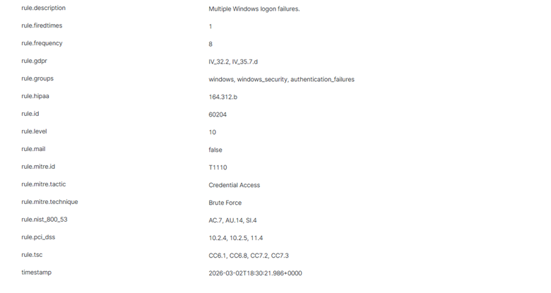
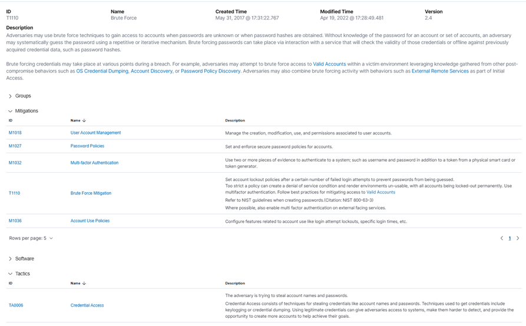

### File Integrity Violation — T1070.004

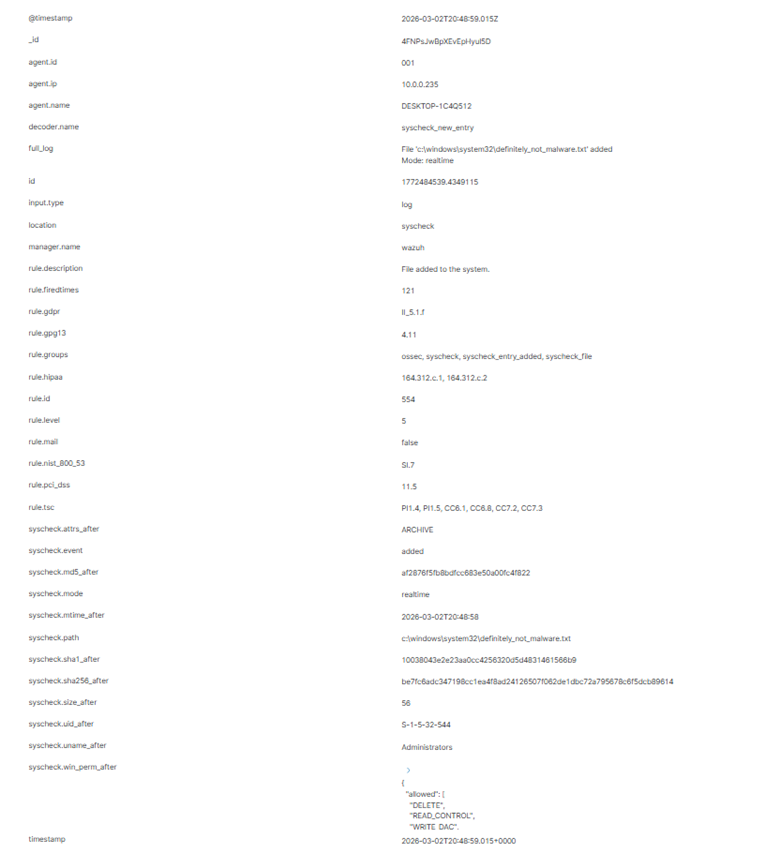


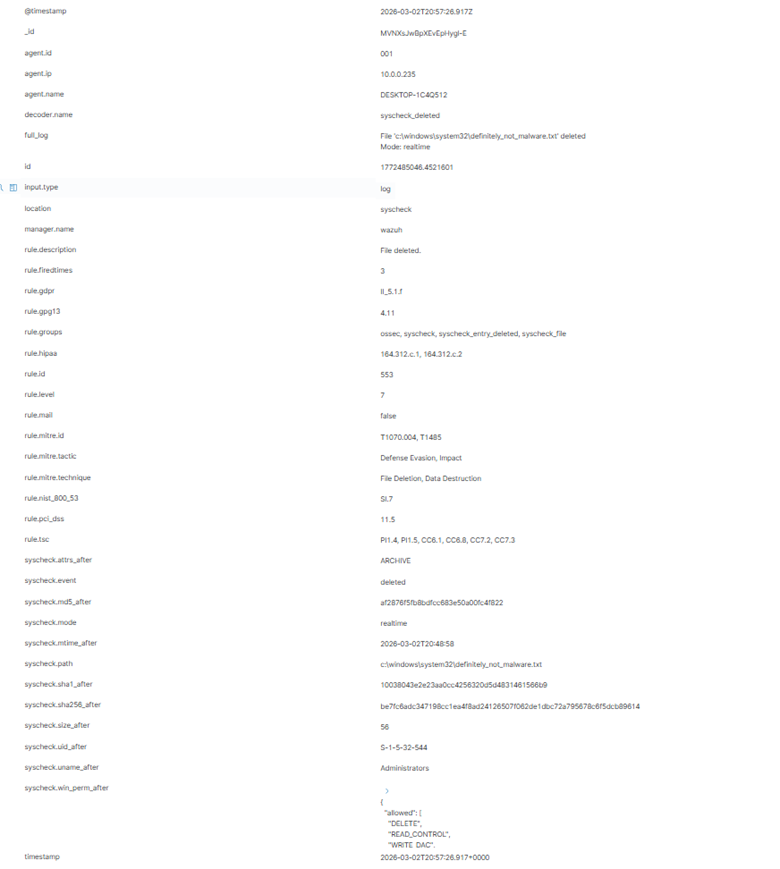
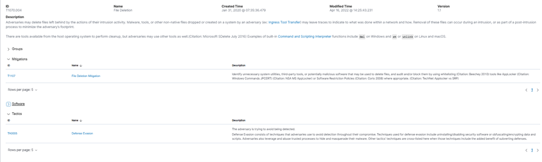

### New Admin Account — T1098, T1484

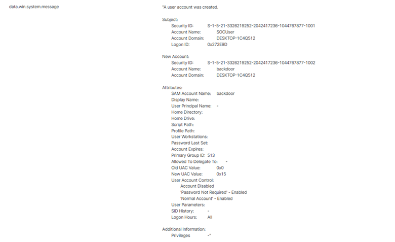
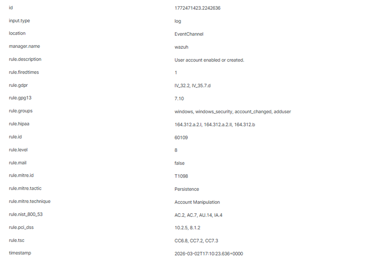
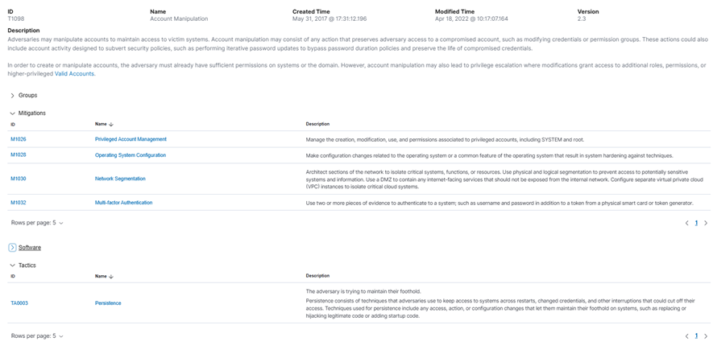

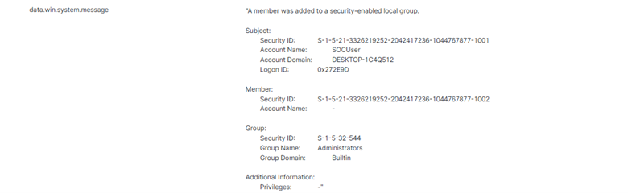
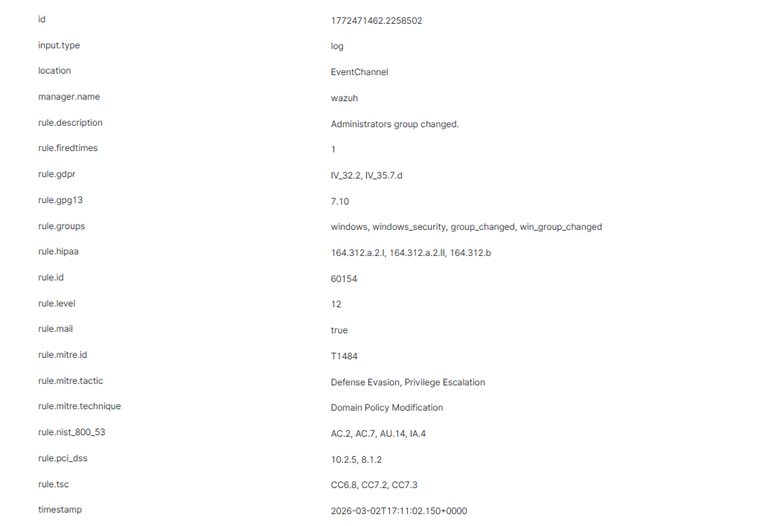
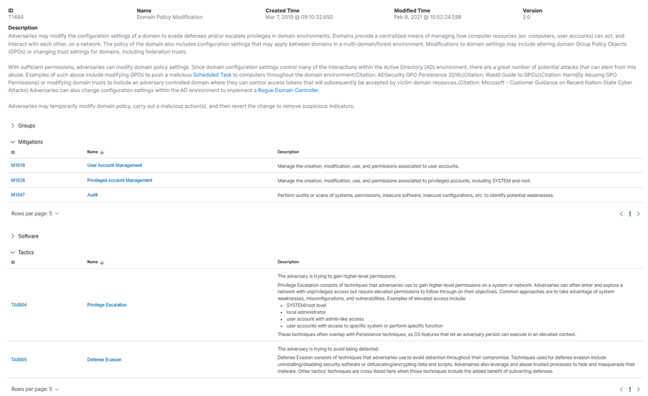

### Clear Event Logs — T1070.001

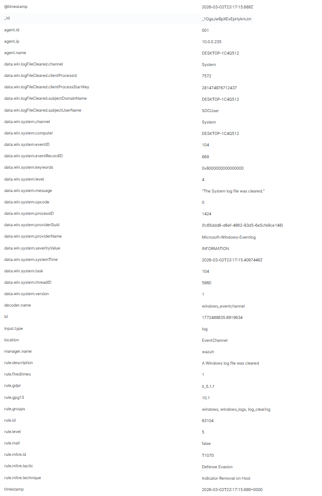
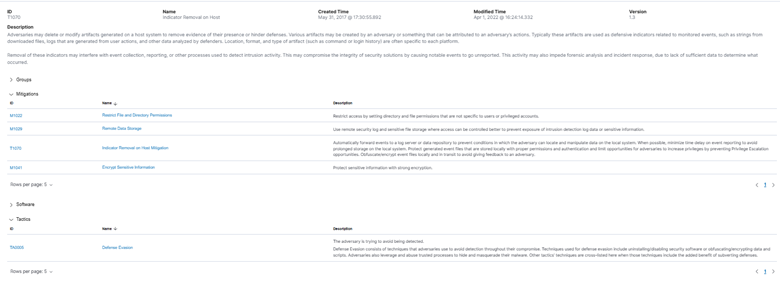

### Malicious Service Creation — T1543.003

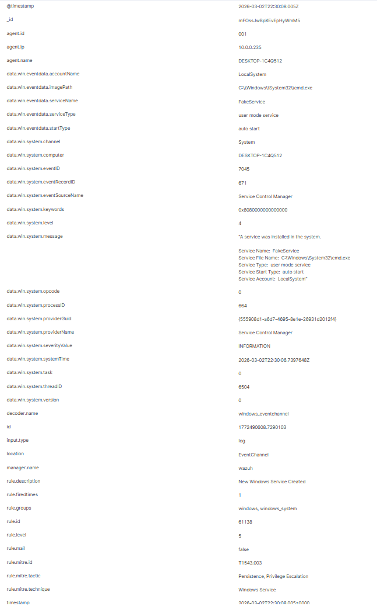
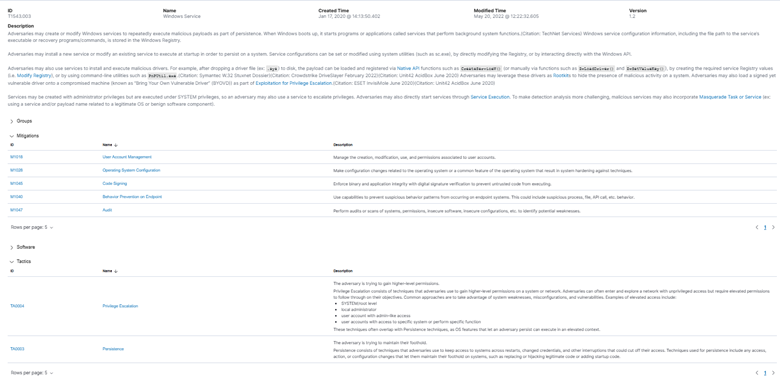

## Detection Gaps & Tuning
During this exercise several configurations required manual tuning:

- **FIM** required adding System32 to ossec.conf with realtime enabled
- **Registry monitoring** required explicit windows_registry entries
- **PowerShell logging** required enabling Script Block Logging via registry

This reflects real SOC work where continuous detection tuning is as 
important as initial SIEM deployment.

## Incident Report
Full findings documented in [incident-report.pdf](incident-report.pdf)
```
